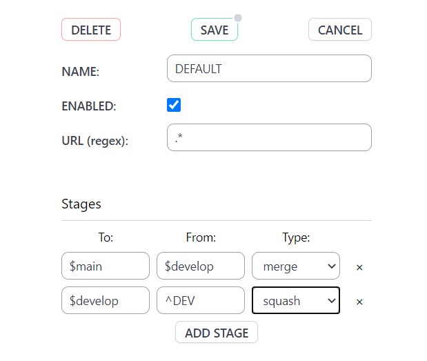

# gitNub

GitNub helps reduce accidents such as accidentally merging when you meant to squash, or creating a PR for the wrong branch.

Setup a github url and define stages for your per-repo workflow. Fields use regex values to allow better customization.

Example

using TO:`main` FROM:`^DEV` TYPE: `squash`  
will show a success indication on the to-branch name for the repo's PRs when the PR is merging from branch such as DEV-220 into main branch, and the merge-action dropdown will only show the `squash` option in green.

